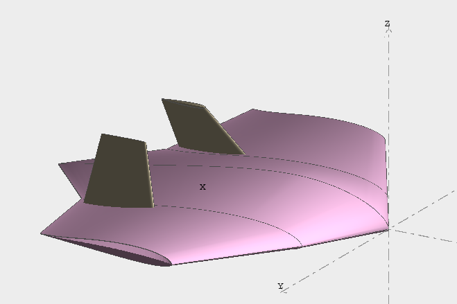
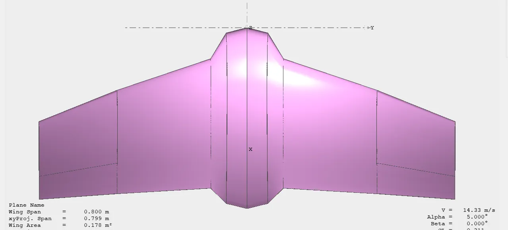
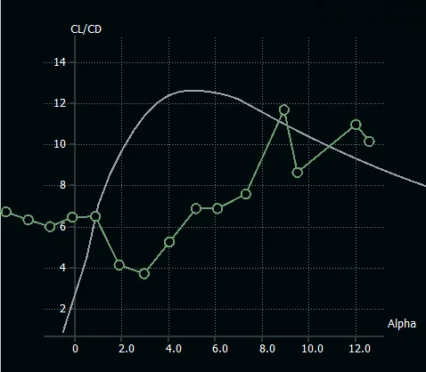
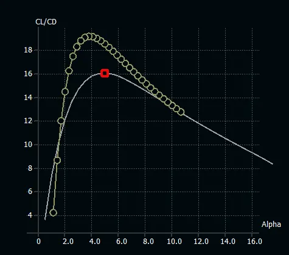

As Kora Aerospace team, we approach the design of UAV as a fully integrated process, where aerodynamics, structures and control are developed together rather than as isolated components. One of our primary goals was not to achieve only design requirements, but also to establish a strong and coherent design philosophy.

## Choosing a Different Starting Point

We chose a flying wing configuration intentionally from the start. This decision was not made simply to be unconventional, but to challenge ourselves from an engineering standpoint and to present a conceptually strong and distinctive solution in the competitions. We wanted our aircraft to reflect a clear design philosophy rather than an incremental modification of a standard layout. A flying wing offered a unique opportunity to explore an unconventional design space while still being strongly grounded in aerodynamic efficiency.

Our initial concept was a flying wing with a wingspan of 50 cm as seen in Figure 1. This choice was driven by two main ideas. First, a very small aircraft would be harder to detect and track, an important advantage in a combat-oriented scenario. Second, we wanted to explore if it was possible to design a UAV that is physically small, yet aerodynamically efficient and highly maneuverable. In other words, our vision was to create an aircraft that would be "small in size, but big in capability."

*Figure 1. Initial flying wing concept with a target wingspan of 50 cm*

## Why Size and Efficiency Are Critical

For a small UAV, size alone is not enough. The aircraft must still generate sufficient lift, remain stable, and retain good maneuverability, especially at low speeds as we wanted in our case. As the scale decreases, payload and onboard systems represent a larger fraction of the total weight, increasing wing loading and making lift generation more challenging.

Therefore, our design priorities became clear:

- The aircraft had to be small to reduce detectability especially for Teknofest competition and also to earn more point in SUAS competition.
- It had to be slow and agile for practical operation.
- It had to be aerodynamically efficient enough to compensate for the limited size we wanted.

This naturally led us to configurations in which almost every surface contributes to lift and where unnecessary drag producing components are avoided. Scale visualization is shown in Figure 2.

*Figure 2. Scale Visualization highlighting the compact size of the UAV concept*

## Why a Flying Wing Instead of a Fuselage

Initially, a small fuselage-based configuration and a normal flying wing configuration were considered both. However, it quickly became clear that a small fuselage based configuration would be aerodynamically disadvantageous. In conventional layouts, the fuselage produces little or no lift while adding parasite drag and structural mass. Especially for a very small UAV, this becomes even more severe since nonlifting surfaces occupy a large fraction of the total geometry.

Then, when we consider the weight, our payload requirements were relatively high for our mini UAV, which meant that high lift capability at low speed was essential. Using a fuselage based configuration reduces the effective lifting area and that would directly lower the lift to weight ratio and degrade performance. On the other hand, a flying wing provides us the entire planform to generate lift, maximizing aerodynamic efficiency within a limited span.

In addition, the compact nature of a flying wing supports lower observability by reducing frontal area and geometric discontinuities that increase detectability. For a small and agile UAV, this made the flying wing the most logical configuration.

To sum up, the flying wing configuration provided several key advantages:

- All surfaces contribute directly to lift generation
- Reduced parasite drag due to the absence of a fuselage
- Improved lift-to-weight ratio for small scale operation
- Compact geometry with lower frontal area

*Figure 3. Lift distribution of a fuselage based configuration, showing no lift production of fuselage*

## The Challenge of Stability and Control

Removing the tail introduces significant stability and control challenges. In tailless aircraft, longitudinal stability and trim must be achieved through careful airfoil selection, center of gravity placement and control surface design.

To address this, we adopted a reflex airfoil to provide the required pitching moment characteristics and designed elevons to supply both pitch and roll control. At the low Reynolds number associated with small UAVs, airfoil performance and control effectiveness become particularly sensitive, making aerodynamic and stability considerations tightly coupled in our design process.

## When Physics Set the Limits: From 50 cm to 80 cm

Our original target wingspan of 50 cm was the ideal in terms of earning more points and detectability. However, as the design matured and preliminary aerodynamic and weight analyses were performed, fundamental physical limitations became apparent. At such a small scale, wing loading increased too much while low Reynolds number effects reduced achievable lift coefficients and also aerodynamic efficiency.

Performance estimates showed that sufficient lift at low speeds requires very high angles of attack or excessive propulsion power at 50 cm span, which has disadvantages in terms of stability and control margins. In other words, the configuration was conceptually attractive but not practically reliable.

To resolve this, we increased the wingspan to 80 cm as seen in Figure 4. This wingspan allowed us to operate in a more favorable Reynolds number regime, reduce wing loading and significantly improve lift generation. The transition from 50 cm to 80 cm was therefore not a change in design philosophy, but an adaptation to aerodynamic and structural reality.

*Figure 4. New design of the UAV with 80 cm wingspan*

*Figure 5. Scale visualization of the new UAV*

*Figure 6. Performance and stability analysis of first UAV with 50 cm wingspan*

*Figure 7. Performance and stability analysis of second UAV with 80 cm wingspan*

## A Configuration Driven by Mission and Physics

During the process, the flying wing remained the core of our design philosophy. The combination of small size, low detectability, high lift requirement, low speed maneuverability, and aerodynamic efficiency consistently pointed toward a fully lifting, tailless configuration.

In summary, we did not "end up" with a flying wing by chance. We started with it deliberately, aiming to design a UAV that would be small enough to be hard to detect, agile enough for maneuvering, and efficient enough to sustain low-speed flight. When physical limitations prevented the realization of our initial 50 cm target, we adapted the scale while preserving the same design logic.

KORA Aerospace ekibi olarak, İHA tasarımına aerodinamik, yapısal ve kontrol unsurlarının birbirinden bağımsız değil, birlikte geliştirildiği tam entegre bir süreç olarak yaklaşıyoruz. Birincil hedeflerimizden biri sadece tasarım gereksinimlerini karşılamak değil, aynı zamanda güçlü ve tutarlı bir tasarım felsefesi oluşturmaktı.

## Farklı Bir Başlangıç Noktası Seçmek

En başından itibaren bilinçli olarak uçan kanat konfigürasyonunu tercih ettik. Bu karar sadece alışılmadık olmak için değil, mühendislik açısından kendimizi zorlamak ve yarışmalarda kavramsal olarak güçlü ve ayırt edici bir çözüm sunmak için alındı. Uçağımızın standart bir düzenin kademeli modifikasyonu yerine net bir tasarım felsefesini yansıtmasını istedik. Uçan kanat, aerodinamik verimlilik temelinde kalırken alışılmadık bir tasarım alanını keşfetmek için benzersiz bir fırsat sundu.

İlk konseptimiz Şekil 1'de görüldüğü gibi 50 cm kanat açıklığına sahip bir uçan kanattı. Bu tercih iki ana fikir tarafından yönlendirildi. Birincisi, çok küçük bir uçak tespit edilmesi ve takip edilmesi daha zor olacaktı - savaş odaklı bir senaryoda önemli bir avantaj. İkincisi, fiziksel olarak küçük ama aerodinamik açıdan verimli ve yüksek manevra kabiliyetine sahip bir İHA tasarlamanın mümkün olup olmadığını keşfetmek istedik. Başka bir deyişle vizyonumuz "boyutu küçük ama kabiliyeti büyük" bir uçak yaratmaktı.

*Şekil 1. 50 cm hedef kanat açıklığına sahip ilk uçan kanat konsepti*

## Boyut ve Verimlilik Neden Kritik

Küçük bir İHA için tek başına boyut yeterli değildir. Uçak yine de yeterli kaldırma kuvveti üretmeli, kararlı kalmalı ve özellikle bizim durumumuzda istediğimiz gibi düşük hızlarda iyi manevra kabiliyetini korumalıdır. Ölçek küçüldükçe, yük ve yerleşik sistemler toplam ağırlığın daha büyük bir kısmını temsil eder, kanat yüklemesini artırır ve kaldırma kuvveti üretimini daha zorlu hale getirir.

Bu nedenle tasarım önceliklerimiz netleşti:

- Uçak özellikle Teknofest yarışması için tespit edilebilirliği azaltmak ve ayrıca SUAS yarışmasında daha fazla puan kazanmak için küçük olmalıydı.
- Pratik operasyon için yavaş ve çevik olmalıydı.
- İstediğimiz sınırlı boyutu telafi edecek kadar aerodinamik açıdan verimli olmalıydı.

Bu doğal olarak bizi neredeyse her yüzeyin kaldırma kuvvetine katkıda bulunduğu ve gereksiz sürükleme üreten bileşenlerden kaçınıldığı konfigürasyonlara yöneltti.

*Şekil 2. İHA konseptinin kompakt boyutunu vurgulayan ölçek görselleştirmesi*

## Neden Gövde Yerine Uçan Kanat

Başlangıçta hem küçük gövde tabanlı konfigürasyon hem de normal uçan kanat konfigürasyonu değerlendirildi. Ancak küçük gövde tabanlı bir konfigürasyonun aerodinamik açıdan dezavantajlı olacağı hızla netleşti. Geleneksel düzenlerde gövde, parazit sürükleme ve yapısal kütle eklerken çok az kaldırma kuvveti üretir veya hiç üretmez.

Ağırlığı düşündüğümüzde, mini İHA'mız için yük gereksinimlerimiz nispeten yüksekti, bu da düşük hızda yüksek kaldırma kapasitesinin gerekli olduğu anlamına geliyordu. Gövde tabanlı bir konfigürasyon kullanmak etkili kaldırma alanını azaltır ve bu doğrudan kaldırma/ağırlık oranını düşürür ve performansı bozar. Öte yandan, uçan kanat tüm planformu kaldırma kuvveti üretmek için kullanmamızı sağlar ve sınırlı açıklık içinde aerodinamik verimliliği maksimize eder.

Uçan kanat konfigürasyonu birkaç temel avantaj sağladı:

- Tüm yüzeyler doğrudan kaldırma kuvveti üretimine katkıda bulunur
- Gövdenin olmaması nedeniyle azaltılmış parazit sürükleme
- Küçük ölçekli operasyon için iyileştirilmiş kaldırma/ağırlık oranı
- Daha düşük ön alanlı kompakt geometri

*Şekil 3. Gövdenin kaldırma kuvveti üretmediğini gösteren gövde tabanlı konfigürasyonun kaldırma dağılımı*

## Stabilite ve Kontrol Zorluğu

Kuyruğun kaldırılması önemli stabilite ve kontrol zorlukları ortaya çıkarır. Kuyruksuz uçaklarda boylamsal stabilite ve trim, dikkatli kanat profili seçimi, ağırlık merkezi yerleşimi ve kontrol yüzeyi tasarımı ile sağlanmalıdır.

Bunu ele almak için, gerekli yunuslama momenti özelliklerini sağlamak üzere refleks kanat profili benimsedik ve hem yunuslama hem de yuvarlanma kontrolü sağlamak için elevonlar tasarladık.

## Fizik Sınırları Belirlediğinde: 50 cm'den 80 cm'ye

Orijinal 50 cm kanat açıklığı hedefimiz puan kazanma ve tespit edilebilirlik açısından idealdi. Ancak tasarım olgunlaştıkça ve ön aerodinamik ve ağırlık analizleri yapıldıkça, temel fiziksel sınırlamalar ortaya çıktı. Bu kadar küçük bir ölçekte, kanat yüklemesi çok fazla artarken düşük Reynolds sayısı etkileri ulaşılabilir kaldırma katsayılarını ve aerodinamik verimliliği azalttı.

Bunu çözmek için kanat açıklığını Şekil 4'te görüldüğü gibi 80 cm'ye çıkardık. Bu kanat açıklığı daha uygun bir Reynolds sayısı rejiminde çalışmamızı, kanat yüklemesini azaltmamızı ve kaldırma üretimini önemli ölçüde iyileştirmemizi sağladı.

*Şekil 4. 80 cm kanat açıklığına sahip İHA'nın yeni tasarımı*

*Şekil 5. Yeni İHA'nın ölçek görselleştirmesi*

*Şekil 6. 50 cm kanat açıklığına sahip ilk İHA'nın performans ve stabilite analizi*

*Şekil 7. 80 cm kanat açıklığına sahip ikinci İHA'nın performans ve stabilite analizi*

## Görev ve Fizik Tarafından Yönlendirilen Bir Konfigürasyon

Süreç boyunca uçan kanat, tasarım felsefemizin özü olarak kaldı. Küçük boyut, düşük tespit edilebilirlik, yüksek kaldırma gereksinimi, düşük hız manevra kabiliyeti ve aerodinamik verimliliğin kombinasyonu sürekli olarak tamamen kaldırma üreten, kuyruksuz bir konfigürasyona işaret etti.

Özetle, uçan kanata tesadüfen "son vermedik". Tespit edilmesi zor olacak kadar küçük, manevra için yeterince çevik ve düşük hızda uçuşu sürdürecek kadar verimli bir İHA tasarlamayı amaçlayarak bilerek onunla başladık. Fiziksel sınırlamalar ilk 50 cm hedefimizin gerçekleştirilmesini engellediğinde, aynı tasarım mantığını korurken ölçeği uyarladık.

