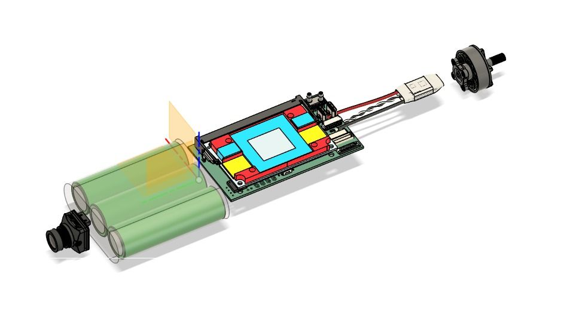
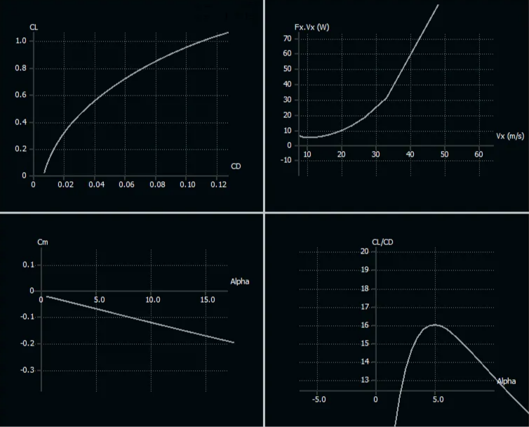

## Choosing the Right Airfoil for a Flying Wing UAV

At KORA Aerospace, we didn't approach airfoil selection as a simple "pick the best one from a database" task. Since our UAV is a **flying wing with no tail**, the airfoil choice plays a much bigger role than it would in a conventional aircraft.

In our case, the airfoil is not just responsible for lift. It directly affects **stability, control, and overall flight behavior**.

That's why we built our airfoil selection process around the **entire aircraft**, not just the airfoil itself.

### Where We Started

We began by selecting several candidate airfoils from online databases such as Airfoil Tools, focusing on profiles suitable for **low Reynolds number flight**, for small UAVs. Rather than committing to a single airfoil early on, we intentionally evaluated a diverse set of candidates to better understand how different geometric properties affect lift, stability, and control in a flying-wing configuration.

Our initial candidate airfoil set included:

- **EH series airfoils** (e.g., *eh1590*, *eh2-12*), offering moderate thickness and camber characteristics
- **Eppler airfoils** (e.g., *Eppler E387*), known for their low-Reynolds-number performance and high lift potential
- **Selig airfoils** (e.g., *selig1223*, *seligs5020*), commonly used in UAV and glider applications
- **Wortmann FX series** (e.g., *FX 63-137*), representing higher-performance laminar-flow designs
- **NACA airfoils** (e.g., *NACA 2415*, *NACA 64-008*), included mainly as reference baselines
- **MH series airfoils** (e.g., *mh45t10*, *mh46t11*, *mh60t10*), frequently used in flying wings and tailless aircraft

We compared thin and thick sections in terms of both aerodynamic performance and structural feasibility. In particular, we intentionally used a **thicker airfoil at the root**, allowing the center section of the wing to act almost like a body. This provided enough internal volume to accommodate internal flight package components such as the battery, avionics, and wiring without introducing a separate fuselage.

Below is our internal parts geometry reference:

Beyond this central region, where internal volume is no longer a driving requirement, we decided to transition to thinner airfoils toward the rest of the wing. Using thinner sections after the root allowed us to improve aerodynamic efficiency and reduce drag without compromising the overall configuration.

### Why 2D Airfoil Analysis Wasn't Enough

Our first step was to analyze each airfoil individually to understand its basic behavior. This helped us quickly eliminate options that were clearly unsuitable.

However, we didn't stop there.

For a flying wing, a "good" 2D airfoil may not be good once integrated into a real wing. High lift alone doesn't mean much if the aircraft becomes unstable or difficult to control.

So instead of selecting an airfoil purely based on polar plots, we moved on to aircraft-level analysis.

### Analyzing the Full Aircraft

Using XFLR5, we integrated each candidate airfoil into our wing and analyzed the **entire flying wing configuration**. This allowed us to evaluate:

- Whether the wing could generate enough lift at low flight velocities, which we considered advantageous for our mission profile
- How lift was distributed along the span
- Whether the configuration remained longitudinally stable

This step was where the real differences between airfoils appeared. Selig airfoils, while promising in isolated 2D analysis, once integrated into the full aircraft, leading to reduced stability that are particularly problematic for a tailless flying-wing configuration.

### Geometry Matters Especially Without a Tail

Since our aircraft has **no tail**, airfoil geometry became even more critical. Features such as:

- Trailing-edge shape
- Reflex or near-reflex behavior
- Thickness distribution

had a direct impact on stability.

Airfoils that produced strong nose-down pitching moments were quickly ruled out, while those that offered a more balanced moment behavior worked much better with our configuration.

This is also where flap usage came into play. For most of the wing, especially toward the tip, we focused on airfoils that could work well **with flaps**, allowing us to increase lift when needed without sacrificing overall stability.

### Our Final Configuration

After multiple iterations and comparisons, we converged on a mixed approach:

- At the **root**, we selected an **SB 96 12.7/3.0 airfoil** with maximum thickness around %12, which provided a good balance between lift generation and structural thickness.

- Toward the **tip**, and for most of the wing, we chose **MH45** with maximum thickness around %10, used in a flapped configuration. This helped us fine-tune lift distribution and maintain control authority without introducing a tail.

Rather than maximizing a single performance metric, this combination allowed us to achieve:

- Sufficient lift across the wing
- Better overall stability for a tailless aircraft
- Flexibility through control surfaces

Below is lift profile and stability analysis results for our final configuration.

**Lift Profile:**

AoA=4° (cruise)

AoA=6° (low velocity)

In both cases, the spanwise lift profile remains smooth and symmetric, with a similar overall shape. Despite the change in velocity and angle of attack, no abrupt shifts or localized load concentrations are observed along the wing.

**Stability Analysis:**

Without flaps:

With flaps:

In the plots, the Cm–α curve shows a clear negative slope, indicating positive longitudinal static stability.

With flaps deployed, the pitching moment remains approximately constant and close to zero over the analyzed AoA range. While flap deployment significantly increases lift, the absence of a destabilizing trend in the Cm–α response suggests that the overall pitching behavior remains well-controlled for the flying-wing configuration.

### What We Learned

Airfoil selection for a flying wing is not about finding the "best" airfoil—it's about finding the right balance within the full aircraft configuration.

Our final choice reflects a series of trade-offs between maximum lift, pitching moment behavior, and stability requirements. Evaluating airfoils at both the airfoil level and the full UAV level allowed us to avoid over-optimizing a single metric and arrive at a design that performs well in practice, not just in theory.

This process ultimately led us to a configuration with a thicker **SB 96 12.7/3.0** airfoil at the root and a thinner, flapped **MH45** toward the outer wing, providing a balanced compromise between internal volume, aerodynamic efficiency, and stability.

## Uçan Kanat İHA için Doğru Kanat Profilini Seçmek

KORA Aerospace'te kanat profili seçimine basit bir "veritabanından en iyisini seç" görevi olarak yaklaşmadık. İHA'mız **kuyruğu olmayan bir uçan kanat** olduğu için, kanat profili seçimi geleneksel bir uçakta olduğundan çok daha büyük bir rol oynuyor.

Bizim durumumuzda, kanat profili sadece kaldırma kuvvetinden sorumlu değil. **Stabiliteyi, kontrolü ve genel uçuş davranışını** doğrudan etkiliyor.

Bu yüzden kanat profili seçim sürecimizi sadece kanat profilinin kendisi yerine **tüm uçak** etrafında oluşturduk.

### Nereden Başladık

Küçük İHA'lar için **düşük Reynolds sayılı uçuşa** uygun profillere odaklanarak, Airfoil Tools gibi çevrimiçi veritabanlarından birkaç aday kanat profili seçerek başladık. Tek bir kanat profiline erken bağlanmak yerine, farklı geometrik özelliklerin uçan kanat konfigürasyonunda kaldırma, stabilite ve kontrolü nasıl etkilediğini daha iyi anlamak için kasıtlı olarak çeşitli aday setini değerlendirdik.

İlk aday kanat profili setimiz şunları içeriyordu:

- **EH serisi kanat profilleri** (örn., *eh1590*, *eh2-12*), orta kalınlık ve kamber özellikleri sunan
- **Eppler kanat profilleri** (örn., *Eppler E387*), düşük Reynolds sayısı performansı ve yüksek kaldırma potansiyeli ile bilinen
- **Selig kanat profilleri** (örn., *selig1223*, *seligs5020*), İHA ve planör uygulamalarında yaygın olarak kullanılan
- **Wortmann FX serisi** (örn., *FX 63-137*), daha yüksek performanslı laminer akış tasarımlarını temsil eden
- **NACA kanat profilleri** (örn., *NACA 2415*, *NACA 64-008*), esas olarak referans temel noktaları olarak dahil edilen
- **MH serisi kanat profilleri** (örn., *mh45t10*, *mh46t11*, *mh60t10*), uçan kanatlarda ve kuyruksuz uçaklarda sıkça kullanılan

Özellikle kök bölgesinde **daha kalın bir kanat profili** kullanarak, kanadın merkez bölümünün neredeyse bir gövde gibi davranmasını sağladık. Bu, ayrı bir gövde oluşturmadan batarya, aviyonik ve kablolama gibi dahili uçuş paketi bileşenlerini barındırmak için yeterli iç hacim sağladı.

Aşağıda iç parça geometri referansımız bulunmaktadır:

### 2D Kanat Profili Analizi Neden Yeterli Değildi

İlk adımımız, temel davranışını anlamak için her kanat profilini ayrı ayrı analiz etmekti. Bu, açıkça uygun olmayan seçenekleri hızla elememize yardımcı oldu.

Ancak burada durmadık.

Uçan kanat için, "iyi" bir 2D kanat profili gerçek bir kanada entegre edildiğinde iyi olmayabilir. Uçak kararsız veya kontrol edilmesi zor hale gelirse, tek başına yüksek kaldırma pek bir anlam ifade etmez.

Bu yüzden polar grafiklerine göre kanat profili seçmek yerine uçak düzeyinde analize geçtik.

### Tam Uçağı Analiz Etmek

XFLR5 kullanarak, her aday kanat profilini kanımıza entegre ettik ve **tüm uçan kanat konfigürasyonunu** analiz ettik. Bu bize şunları değerlendirmemizi sağladı:

- Kanadın görev profilimiz için avantajlı gördüğümüz düşük uçuş hızlarında yeterli kaldırma üretip üretemeyeceği
- Kaldırmanın açıklık boyunca nasıl dağıldığı
- Konfigürasyonun boylamsal olarak kararlı kalıp kalmadığı

### Özellikle Kuyruk Olmadan Geometri Önemli

Uçağımızın **kuyruğu olmadığı** için kanat profili geometrisi daha da kritik hale geldi. Şu özellikler:

- Firar kenarı şekli
- Refleks veya reflekse yakın davranış
- Kalınlık dağılımı

stabilite üzerinde doğrudan etkiye sahipti.

### Final Konfigürasyonumuz

Birden fazla iterasyon ve karşılaştırmadan sonra karma bir yaklaşıma ulaştık:

- **Kök** bölgesinde, kaldırma üretimi ve yapısal kalınlık arasında iyi bir denge sağlayan, maksimum kalınlığı yaklaşık %12 olan **SB 96 12.7/3.0 kanat profilini** seçtik.

- **Uç** bölgesine doğru ve kanadın büyük kısmında, flaplı konfigürasyonda kullanılan, maksimum kalınlığı yaklaşık %10 olan **MH45**'i tercih ettik. Bu, kuyruk tanıtmadan kaldırma dağılımını ince ayarlamamıza ve kontrol otoritesini korumamıza yardımcı oldu.

Tek bir performans metriğini maksimize etmek yerine, bu kombinasyon şunları başarmamızı sağladı:

- Kanat boyunca yeterli kaldırma
- Kuyruksuz uçak için daha iyi genel stabilite
- Kontrol yüzeyleri aracılığıyla esneklik

Aşağıda final konfigürasyonumuz için kaldırma profili ve stabilite analizi sonuçları bulunmaktadır.

**Kaldırma Profili:**

AoA=4° (seyir)

AoA=6° (düşük hız)

Her iki durumda da, açıklık boyunca kaldırma profili benzer genel şekille pürüzsüz ve simetrik kalıyor.

**Stabilite Analizi:**

Flapsız:

Flaplı:

Grafiklerde, Cm–α eğrisi net bir negatif eğim gösteriyor, bu da pozitif boylamsal statik stabiliteyi gösteriyor.

### Ne Öğrendik

Uçan kanat için kanat profili seçimi "en iyi" kanat profilini bulmakla ilgili değil—tam uçak konfigürasyonu içinde doğru dengeyi bulmakla ilgili.

Final seçimimiz maksimum kaldırma, yunuslama momenti davranışı ve stabilite gereksinimleri arasındaki bir dizi ödünleşimi yansıtıyor. Kanat profillerini hem profil düzeyinde hem de tam İHA düzeyinde değerlendirmek, tek bir metriği aşırı optimize etmekten kaçınmamızı ve sadece teoride değil, pratikte de iyi performans gösteren bir tasarıma ulaşmamızı sağladı.

Bu süreç nihayetinde bizi kök bölgesinde daha kalın **SB 96 12.7/3.0** kanat profili ve dış kanata doğru daha ince, flaplı **MH45** ile iç hacim, aerodinamik verimlilik ve stabilite arasında dengeli bir uzlaşma sağlayan bir konfigürasyona yöneltti.

