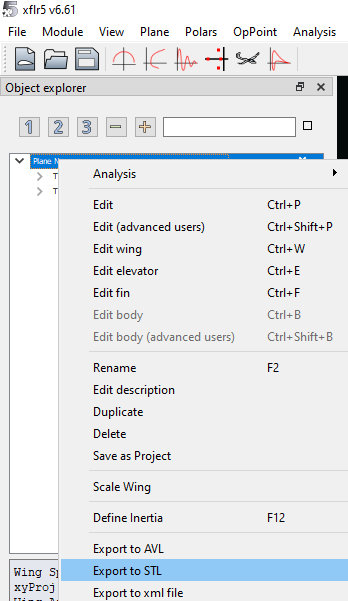

<div lang="en">

At [KORA](https://www.kora-aerospace.org/), we're building UAVs from scratch—airframe, avionics, and everything in between. A critical part of our workflow is going from aerodynamic design to manufacturable CAD models. This post documents our pipeline for taking a wing designed in XFLR5 and turning it into a precise, solid 3D model in [Autodesk Fusion 360](https://www.autodesk.com/products/fusion-360/personal).

Why does it matter? Because accurate geometry is critical when it comes to the last 5%. A wing that performs well in simulation needs to be built *exactly* or as closely as possible to the base design. Any and all deviation in airfoil shape, twist, or chord distribution can significantly affect flight characteristics. For this reason we've developed this workflow to ensure our manufactured wings match our aerodynamic intent.

---

## What is XFLR5?

[XFLR5](https://www.xflr5.tech/) is an open-source analysis tool for airfoils, wings, and aircraft operating at low Reynolds numbers. It's widely used in the RC aircraft, UAV, and glider communities for:

- **Airfoil analysis** using XFoil's direct and inverse methods
- **Wing and plane design** with VLM (Vortex Lattice Method) and 3D panel methods
- **Stability analysis** for full aircraft configurations


*Screenshot of XFLR5 showing a wing design with multiple airfoil sections*

XFLR5 is excellent for aerodynamic design and analysis, but it doesn't produce CAD-ready geometry. That's where the challenge begins.

---

## The Problem: XFLR5 to CAD is Not Straightforward

When you export a wing from XFLR5, you get an `.xml` file containing:

- Wing section positions (spanwise locations)
- Airfoil names for each section
- Chord lengths
- Twist angles (washout/washin)
- Dihedral and sweep information

**What you don't get:** actual airfoil coordinate data embedded in a format CAD software can directly import.

The airfoils themselves are stored separately as `.dat` files—simple text files containing X-Y coordinates in **Selig format**:

```
NACA 2412
1.000000  0.001260
0.950000  0.011900
0.900000  0.022100
...
0.000000  0.000000
...
1.000000 -0.001260
```

The coordinates run from the trailing edge, around the leading edge, and back to the trailing edge. X values are normalized (0 to 1), and Y values represent the thickness/camber distribution.

---

## Quick Alternative: Export a Mesh Directly from XFLR5

Before diving into the full CAD workflow, it's worth knowing that XFLR5 can export a 3D mesh of your aircraft directly:

1. In the **Plane/Wing view**, right-click on your plane in the object list
2. Select **Export Mesh**
3. Choose your resolution (around **80 points per variable** is a good reference for decent detail)
4. Save as `.stl` or similar mesh format

> **Important:** The exported mesh is scaled **1:100**. You'll need to scale it up by a factor of **100×** in your CAD software to get real-world dimensions.



*XFLR5 right-click menu showing the Export to STL (Mesh) option on a plane object*

**When is this useful?**

- Quick visualization of your design in CAD
- Checking proportions and fit with other components early on
- Creating renders or presentations before finalizing geometry

**When is this NOT enough?**

- Mesh geometry isn't parametric or easily editable
- Surface quality may not be sufficient for manufacturing (3D printing, CNC)
- No control over individual airfoil accuracy or loft quality

For CAD models you can shell and add/remove volume from, you'll want to follow the full workflow below and get a solid body.

---

## Step-by-Step: Manual Workflow for XFLR5 to CAD

### Step 1: Export Your Airfoil .dat Files

In XFLR5, go to **File → Export → Current Foil** for each airfoil used in your wing. Alternatively, download airfoils from databases like:

- [Airfoil Tools](http://airfoiltools.com/) - searchable database with polar data
- [UIUC Airfoil Database](https://m-selig.ae.illinois.edu/ads/coord_database.html) - comprehensive academic resource


*Example of airfoils you can download as a .dat file from airfoiltools.com*

### Step 2: Install an Airfoil Import Add-in for Fusion 360

Fusion 360 doesn't natively import `.dat` files. You'll need an add-in:

[**Airfoil Tools Add-in**](https://apps.autodesk.com/FUSION/en/Detail/Index?id=5447707798035545266) — A free add-in from the Autodesk App Store that:

- Imports `.dat` files directly
- Creates spline sketches from airfoil coordinates
- Allows chord scaling and positioning

Install it via: **Fusion 360 → Utilities → Scripts and Add-ins → Add-ins Tab → Visit Autodesk App Store**


*Fusion 360 Add-ins dialog showing the Airfoil Tools add-in installed*

### Step 3: Import Airfoils at Each Wing Section


*Fusion 360 workspace*

For each wing section defined in your XFLR5 design:

1. Create a **construction plane** at the correct spanwise location
2. Create a line that starts at the correct offset and has the correct span length
3. Use the Airfoil Tools add-in to import the corresponding `.dat` file
4. For the settings of the airfoil: a set of 30 points and a minimum thickness of 0.6mm (less trouble shelling)
5. **Rotate** the airfoil to apply the twist angle (rotation center is located at 1/4 the wingspan)

This is where it gets tedious. A typical wing might have 5-10 sections, each requiring:

- Correct Y-position (span location)
- Correct chord scaling
- Correct twist rotation (around the quarter-chord or leading edge)
- Correct dihedral angle
- Creating correct 3D spline for the rails

### Step 3.5: Retrace the Airfoil as a Closed Spline

> **Critical Step:** The imported airfoil points are most of the times **not connected** into a single closed curve. If you try to loft or extrude directly, Fusion 360 won't recognize a valid face profile.

To create a usable profile, you need to **retrace the airfoil** with the fit-point-spline drawing tool:

1. **Convert the imported lines to construction geometry**
   - Select all the imported airfoil line segments
   - Press **X** or right-click → **Normal/Construction** to toggle them to construction lines (they'll turn orange/dashed)
   - This keeps them visible as a reference without interfering with your sketch

2. **Draw a Fit Point Spline over the airfoil**


*Fusion 360 sketch showing construction lines (dashed) with a fit point spline traced over the airfoil, with the trailing edge closed*

- Go to **Sketch → Create → Fit Point Spline**
- Click along the airfoil points to trace the curve
- **For smooth/gradual curves** (like the middle of the airfoil): you can **skip points** to get a smoother result
- **For sharp/fast-changing curves** (like the leading edge): **select every point** to maintain accuracy

3. **Close the trailing edge**
   - Make sure to connect the upper and lower surfaces at the trailing edge
   - Either click the starting point to close the spline, or draw a short line segment to close the gap
   - The profile must be a **fully closed loop** for lofting to work

Repeat this for each airfoil section before proceeding to the loft.

### Step 4: Loft the Airfoils into a Solid Body


*Fusion 360 loft dialog with multiple airfoil profiles selected, showing the preview of the wing surface*


Once all your airfoil sketches are in place:

1. Go to **Solid → Create → Loft**
2. Select your airfoil profiles in order from root to tip
3. Optionally add **guide rails** along the leading and trailing edges for better surface control
   - If you have a very simple airfoil without rails it is usually fine without. However if there are multiple its best to create a pair of guide rails one at the front and one in the back. You can create this with the 3D sketch feature.
4. Click **OK** to generate the solid wing
5. You can also check your resulting geometry flow by using the zebra surface analysis tool.

The result is a manufacturable solid body that accurately represents your aerodynamic design.


*Final lofted wing solid body in Fusion 360, shown in shaded view with smooth surfaces*

---

## Things That Become Annoying After Doing It a Couple of Times

This manual process has several pain points:

| Challenge | Impact |
| --- | --- |
| **Manual data entry** | Each section requires entering position, chord, and twist values by hand |
| **Rotation reference points** | XFLR5 rotates around the quarter-chord; getting this right in CAD requires calculation |
| **Airfoil file management** | Multiple `.dat` files need to be organized and matched to sections |
| **Repeatability** | Design iterations mean redoing the entire process |
| **Human error** | Easy to make mistakes with so many manual steps |

---

## Our Solution: Automating the Pipeline

After doing this process too many times and making mistakes, we built something better.

> **Coming Soon: KORA Aero-CAD Bridge**
>
> We've developed a **Fusion 360 add-in** that automates the entire XFLR5-to-Fusion workflow:
>
> - 📂 **Reads XFLR5 `.xml` wing exports** directly
> - 📐 **Auto-imports all required airfoil `.dat` files**
> - 🔄 **Positions, scales, and rotates** each section automatically
> - 📏 **Respects XFLR5's rotation conventions** (quarter-chord twist, leading-edge sweep)
> - 🏗️ **Generates the loft** with proper guide rails
> - ⚙️ **Parametric output** — change your XFLR5 design, re-run the script, get updated CAD
>
> **One click. Accurate geometry.**

---

## Interested?

We're currently testing this tool internally and will be releasing it to the community.

**If you'd like early access or want to provide feedback, reach out to us:**

📧 **Email: kora.aerospace@gmail.com**

Let us know:
- Who you are :)
- Your use case (RC planes, drones, gliders, etc.)
- What features would be most valuable to you
- Whether you'd want a free open-source tool or a polished commercial add-in

---

## Resources & References

**Software:**
- [XFLR5 Official Site](https://www.xflr5.tech/) - Download and documentation
- [Airfoil Tools Add-in for Fusion 360](https://apps.autodesk.com/FUSION/en/Detail/Index?id=5447707798035545266)

**Airfoil Databases:**
- [Airfoil Tools](http://airfoiltools.com/) - Search, compare, and download airfoils
- [UIUC Airfoil Coordinates Database](https://m-selig.ae.illinois.edu/ads/coord_database.html) - 1,650+ airfoils in Selig format

**Tutorials:**
- [Importing Airfoil from XFLR5 to Solidworks](https://grabcad.com/tutorials/importing-airfoil-from-xflr5-and-auto-generating-wings-in-solidworks) - GrabCAD tutorial with Excel workflow
- [Wing Design in Fusion 360](https://www.youtube.com/watch?v=XOS2nsbd8Fs) - YouTube tutorial on lofting workflows
- [WingHopper.com](http://WingHopper.com) - Web-based wing CAD with XFLR5 XML export

**Community Discussions:**
- [XFLR5 SourceForge Forum](https://sourceforge.net/p/xflr5/discussion/679396/) - Active community for XFLR5 users

---

*This post is part of our documentation series for the SUAS competition. Follow our development journey at [kora-aerospace.org/blog](http://kora-aerospace.org/blog).*

</div>

<div lang="tr">

[KORA](https://www.kora-aerospace.org/)'da İHA'ları sıfırdan inşa ediyoruz—gövde, aviyonik ve aradaki her şey. İş akışımızın kritik bir parçası aerodinamik tasarımdan üretilebilir CAD modellerine geçmektir. Bu yazı, XFLR5'te tasarlanan bir kanadı alıp [Autodesk Fusion 360](https://www.autodesk.com/products/fusion-360/personal)'da hassas, katı bir 3D modele dönüştürme sürecimizi belgeliyor.

Bu neden önemli? Çünkü son %5'e gelince doğru geometri kritik önem taşıyor. Simülasyonda iyi performans gösteren bir kanat, temel tasarıma *tam olarak* veya mümkün olduğunca yakın inşa edilmelidir. Kanat profili şekli, burulma veya kiriş dağılımındaki herhangi bir sapma uçuş karakteristiklerini önemli ölçüde etkileyebilir. Bu nedenle, üretilen kanatlarımızın aerodinamik niyetimizle eşleşmesini sağlamak için bu iş akışını geliştirdik.

---

## XFLR5 Nedir?

[XFLR5](https://www.xflr5.tech/), düşük Reynolds sayılarında çalışan kanat profilleri, kanatlar ve uçaklar için açık kaynaklı bir analiz aracıdır. RC uçak, İHA ve planör topluluklarında yaygın olarak kullanılır:

- XFoil'in doğrudan ve ters yöntemlerini kullanan **kanat profili analizi**
- VLM (Vorteks Kafes Yöntemi) ve 3D panel yöntemleri ile **kanat ve uçak tasarımı**
- Tam uçak konfigürasyonları için **stabilite analizi**


*Birden fazla kanat profili bölümüne sahip kanat tasarımını gösteren XFLR5 ekran görüntüsü*

XFLR5 aerodinamik tasarım ve analiz için mükemmeldir, ancak CAD'e hazır geometri üretmez. Zorluk burada başlıyor.

---

## Sorun: XFLR5'ten CAD'e Geçiş Kolay Değil

XFLR5'ten bir kanat dışa aktardığınızda, şunları içeren bir `.xml` dosyası alırsınız:

- Kanat kesiti pozisyonları (açıklık boyunca konumlar)
- Her kesit için kanat profili adları
- Kiriş uzunlukları
- Burulma açıları (washout/washin)
- Dihedral ve ok açısı bilgileri

**Alamadığınız:** CAD yazılımının doğrudan içe aktarabileceği bir formatta gömülü gerçek kanat profili koordinat verileri.

Kanat profillerinin kendileri **Selig formatında** X-Y koordinatları içeren basit metin dosyaları olan `.dat` dosyaları olarak ayrı saklanır.

---

## Hızlı Alternatif: XFLR5'ten Doğrudan Mesh Dışa Aktarma

Tam CAD iş akışına girmeden önce, XFLR5'in uçağınızın 3D mesh'ini doğrudan dışa aktarabileceğini bilmekte fayda var:

1. **Uçak/Kanat görünümünde**, nesne listesinde uçağınıza sağ tıklayın
2. **Mesh Dışa Aktar**'ı seçin
3. Çözünürlüğünüzü seçin (iyi detay için **değişken başına yaklaşık 80 nokta** iyi bir referanstır)
4. `.stl` veya benzeri mesh formatı olarak kaydedin

> **Önemli:** Dışa aktarılan mesh **1:100** ölçeklidir. Gerçek dünya boyutlarını elde etmek için CAD yazılımınızda **100×** ölçeklendirmeniz gerekecek.


*Uçak nesnesi üzerinde STL'ye (Mesh) Dışa Aktar seçeneğini gösteren XFLR5 sağ tıklama menüsü*

---

## Adım Adım: XFLR5'ten CAD'e Manuel İş Akışı

### Adım 1: Kanat Profili .dat Dosyalarınızı Dışa Aktarın

XFLR5'te, kanadınızda kullanılan her kanat profili için **Dosya → Dışa Aktar → Mevcut Profil**'e gidin.


*airfoiltools.com'dan .dat dosyası olarak indirebileceğiniz kanat profilleri örneği*

### Adım 2: Fusion 360 için Kanat Profili İçe Aktarma Eklentisi Yükleyin

Fusion 360 `.dat` dosyalarını yerel olarak içe aktarmaz. Bir eklentiye ihtiyacınız olacak:

[**Airfoil Tools Eklentisi**](https://apps.autodesk.com/FUSION/en/Detail/Index?id=5447707798035545266) — Autodesk App Store'dan ücretsiz bir eklenti:

- `.dat` dosyalarını doğrudan içe aktarır
- Kanat profili koordinatlarından spline çizimleri oluşturur
- Kiriş ölçekleme ve konumlandırmaya izin verir


*Airfoil Tools eklentisinin yüklü olduğunu gösteren Fusion 360 Eklentiler iletişim kutusu*

### Adım 3: Her Kanat Kesitinde Kanat Profili İçe Aktarın


*Fusion 360 çalışma alanı*

XFLR5 tasarımınızda tanımlanan her kanat kesiti için:

1. Doğru açıklık konumunda bir **yapım düzlemi** oluşturun
2. Doğru ofsette başlayan ve doğru açıklık uzunluğuna sahip bir çizgi oluşturun
3. İlgili `.dat` dosyasını içe aktarmak için Airfoil Tools eklentisini kullanın
4. Kanat profili ayarları için: 30 nokta seti ve 0.6mm minimum kalınlık
5. Burulma açısını uygulamak için kanat profilini **döndürün** (dönme merkezi kanat açıklığının 1/4'ünde bulunur)

### Adım 3.5: Kanat Profilini Kapalı Spline Olarak Yeniden Çizin

> **Kritik Adım:** İçe aktarılan kanat profili noktaları çoğunlukla tek bir kapalı eğri olarak **bağlı değildir**. Doğrudan loft veya extrude yapmaya çalışırsanız, Fusion 360 geçerli bir yüz profilini tanımaz.

Kullanılabilir bir profil oluşturmak için, fit-point-spline çizim aracıyla **kanat profilini yeniden çizmeniz** gerekir:

1. **İçe aktarılan çizgileri yapım geometrisine dönüştürün**
2. **Kanat profili üzerine Fit Point Spline çizin**


*Firar kenarı kapalı olarak kanat profili üzerine çizilmiş fit point spline ile yapım çizgilerini (kesikli) gösteren Fusion 360 çizimi*

3. **Firar kenarını kapatın**

Her kanat profili kesiti için loft'a geçmeden önce bunu tekrarlayın.

### Adım 4: Kanat Profillerini Katı Gövdeye Loft Edin


*Kanat yüzeyinin önizlemesini gösteren, birden fazla kanat profili seçilmiş Fusion 360 loft iletişim kutusu*


Tüm kanat profili çizimleriniz yerindeyken:

1. **Solid → Create → Loft**'a gidin
2. Kanat profili profillerinizi kökten uca sırayla seçin
3. İsteğe bağlı olarak daha iyi yüzey kontrolü için hücum ve firar kenarları boyunca **kılavuz raylar** ekleyin
4. Katı kanadı oluşturmak için **OK**'a tıklayın
5. Zebra yüzey analizi aracını kullanarak ortaya çıkan geometri akışınızı kontrol edebilirsiniz.

Sonuç, aerodinamik tasarımınızı doğru bir şekilde temsil eden üretilebilir bir katı gövdedir.


*Pürüzsüz yüzeylerle gölgeli görünümde gösterilen Fusion 360'ta final loftlanmış kanat katı gövdesi*

---

## Birkaç Kez Yaptıktan Sonra Can Sıkıcı Olan Şeyler

Bu manuel sürecin birkaç ağrı noktası var:

| Zorluk | Etki |
| --- | --- |
| **Manuel veri girişi** | Her kesit pozisyon, kiriş ve burulma değerlerinin elle girilmesini gerektirir |
| **Dönme referans noktaları** | XFLR5 çeyrek kiriş etrafında döner; bunu CAD'de doğru yapmak hesaplama gerektirir |
| **Kanat profili dosya yönetimi** | Birden fazla `.dat` dosyasının düzenlenmesi ve kesitlerle eşleştirilmesi gerekir |
| **Tekrarlanabilirlik** | Tasarım iterasyonları tüm sürecin yeniden yapılması anlamına gelir |
| **İnsan hatası** | Bu kadar çok manuel adımla hata yapmak kolay |

---

## Çözümümüz: Sürecin Otomasyonu

Bu süreci çok fazla yapıp hatalar yaptıktan sonra, daha iyi bir şey inşa ettik.

> **Yakında: KORA Aero-CAD Bridge**
>
> Tüm XFLR5-Fusion iş akışını otomatikleştiren bir **Fusion 360 eklentisi** geliştirdik:
>
> - 📂 **XFLR5 `.xml` kanat dışa aktarımlarını** doğrudan okur
> - 📐 **Gerekli tüm kanat profili `.dat` dosyalarını otomatik içe aktarır**
> - 🔄 Her kesiti otomatik olarak **konumlandırır, ölçeklendirir ve döndürür**
> - 📏 **XFLR5'in dönme kurallarına uyar** (çeyrek kiriş burulması, hücum kenarı ok açısı)
> - 🏗️ Uygun kılavuz raylarla **loft oluşturur**
> - ⚙️ **Parametrik çıktı** — XFLR5 tasarımınızı değiştirin, scripti yeniden çalıştırın, güncellenmiş CAD alın
>
> **Tek tıklama. Doğru geometri.**

---

## İlgileniyor Musunuz?

Şu anda bu aracı dahili olarak test ediyoruz ve topluluğa yayınlayacağız.

**Erken erişim veya geri bildirim sağlamak istiyorsanız, bize ulaşın:**

📧 **E-posta: kora.aerospace@gmail.com**

Bize şunları bildirin:
- Kim olduğunuz :)
- Kullanım durumunuz (RC uçaklar, dronlar, planörler, vb.)
- Sizin için en değerli olacak özellikler
- Ücretsiz açık kaynak bir araç mı yoksa cilalı ticari bir eklenti mi isteyeceğiniz

---

## Kaynaklar ve Referanslar

**Yazılım:**
- [XFLR5 Resmi Sitesi](https://www.xflr5.tech/) - İndirme ve dokümantasyon
- [Fusion 360 için Airfoil Tools Eklentisi](https://apps.autodesk.com/FUSION/en/Detail/Index?id=5447707798035545266)

**Kanat Profili Veritabanları:**
- [Airfoil Tools](http://airfoiltools.com/) - Kanat profillerini arayın, karşılaştırın ve indirin
- [UIUC Kanat Profili Koordinat Veritabanı](https://m-selig.ae.illinois.edu/ads/coord_database.html) - Selig formatında 1,650+ kanat profili

---

*Bu yazı SUAS yarışması için dokümantasyon serimizin bir parçasıdır. Geliştirme yolculuğumuzu [kora-aerospace.org/blog](http://kora-aerospace.org/blog) adresinden takip edin.*

</div>
