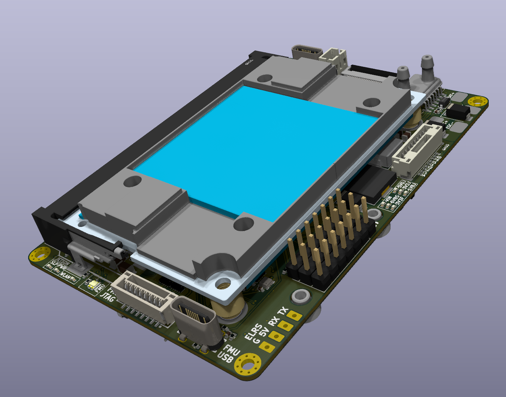

# Why We're Designing Our Own PCB

We are a small university team attending SUAS and Teknofest 2026. Both competitions reward smaller aircraft in direct and indirect ways — SUAS directly gives points for smaller size, Teknofest uses hit detection based on size relative to the video feed, so without adjustable optics, smaller means harder to hit.

So from the start our main design goal was being as small as possible. But it's a tough task considering we need to do onboard video processing and fully autonomous flight.

*Our V1 custom flight controller - 3D Render*

## Why Weight is Critical

For the aircraft to perform the required tasks, it needs a minimum cruise speed no more than 12 m/s. That constraint limits our max wing loading to around 45 g/dm², assuming a cruise C_L of 0.5, in line with high maneuverability RC planes. To make the smallest aircraft possible, we need to minimize weight.

Electronics payload directly determines the weight of the rest of the components — battery and airframe size both depend on total weight. So minimizing electronics weight was essential.

## Component Requirements

For the flight controller, most designs use an STM32F4xx or STM32F7xx. F4 based controllers lack support for many ArduPilot features, so we chose to go with an F7 based controller.

For onboard AI, we initially wanted to use a cheaper accelerator. There are some good options on paper, but after considering availability and ease of use, we decided to go with Jetson Orin Nano. I go into more detail on the image pipeline blog post which is coming soon.

*Orange Pi CM5, one of the AI accelerators we considered*

## The Options

We had 3 choices:

1. F7 FC + Jetson on a carrier board + cabling and extra sensor boards
2. Fully integrated solution like [Airvolute DroneCore Suite 2](https://airvolute.com/shop-prod/uav-autopilots/dcs-2-default/)
3. A custom PCB that only has what we need

| Option | Weight | Cost |
| --- | --- | --- |
| Modular (F7 FC + Jetson & carrier board + wifi + cabling) | ~280g | ~$700 |
| Airvolute DCS-2 | 206g | ~$3,200 |
| Custom PCB | ~90g | ~$650 |

As apparent from this table, the custom option is the lightest by a large margin. But it also requires the most effort.

## Other Benefits

Custom PCB also allows us the most flexibility in terms of Jetson-FC communication. It also allows us to embed sensors and external power circuitry right on the board.

As a long time EE hobbyist, I was eager to take on the custom PCB challenge. So I embarked on the 8 month endeavor of creating our own FC from scratch. I will discuss the custom PCB design journey in a separate blog post coming soon.

# Neden Kendi PCB'mizi Tasarlıyoruz

SUAS ve Teknofest 2026'ya katılan küçük bir üniversite takımıyız. Her iki yarışma da doğrudan ve dolaylı yollarla daha küçük uçakları ödüllendiriyor — SUAS doğrudan daha küçük boyut için puan veriyor, Teknofest video akışına göre boyuta dayalı isabet tespiti kullanıyor, bu yüzden ayarlanabilir optik olmadan, daha küçük olmak isabeti daha zor hale getiriyor.

Bu yüzden en başından itibaren ana tasarım hedefimiz mümkün olduğunca küçük olmaktı. Ama yerleşik video işleme ve tamamen otonom uçuş yapmamız gerektiğini düşünürsek bu zorlu bir görev.

*V1 özel uçuş kontrolcümüz - 3D Render*

## Ağırlık Neden Kritik

Uçağın gerekli görevleri yerine getirmesi için minimum seyir hızının 12 m/s'den fazla olmaması gerekiyor. Bu kısıtlama, yüksek manevra kabiliyetine sahip RC uçaklarla uyumlu olarak 0,5'lik bir seyir C_L varsayarak maksimum kanat yüklememizi yaklaşık 45 g/dm² ile sınırlıyor. Mümkün olan en küçük uçağı yapmak için ağırlığı minimize etmemiz gerekiyor.

Elektronik yük, diğer bileşenlerin ağırlığını doğrudan belirliyor — hem batarya hem de gövde boyutu toplam ağırlığa bağlı. Bu yüzden elektronik ağırlığını minimize etmek esastı.

## Bileşen Gereksinimleri

Uçuş kontrolcüsü için çoğu tasarım STM32F4xx veya STM32F7xx kullanıyor. F4 tabanlı kontrolcüler birçok ArduPilot özelliği için destek sunmuyor, bu yüzden F7 tabanlı bir kontrolcü ile gitmeyi tercih ettik.

Yerleşik AI için başlangıçta daha ucuz bir hızlandırıcı kullanmak istedik. Kağıt üzerinde bazı iyi seçenekler var, ancak bulunabilirlik ve kullanım kolaylığını değerlendirdikten sonra Jetson Orin Nano ile gitmeye karar verdik. Yakında gelecek görüntü işleme hattı blog yazısında daha fazla ayrıntıya gireceğim.

*Değerlendirdiğimiz AI hızlandırıcılardan biri olan Orange Pi CM5*

## Seçenekler

3 seçeneğimiz vardı:

1. Taşıyıcı kart üzerinde F7 FC + Jetson + kablolama ve ekstra sensör kartları
2. [Airvolute DroneCore Suite 2](https://airvolute.com/shop-prod/uav-autopilots/dcs-2-default/) gibi tamamen entegre çözüm
3. Sadece ihtiyacımız olanı içeren özel bir PCB

| Seçenek | Ağırlık | Maliyet |
| --- | --- | --- |
| Modüler (F7 FC + Jetson ve taşıyıcı kart + wifi + kablolama) | ~280g | ~$700 |
| Airvolute DCS-2 | 206g | ~$3.200 |
| Özel PCB | ~90g | ~$650 |

Bu tablodan görüldüğü gibi, özel seçenek büyük bir farkla en hafifi. Ama aynı zamanda en fazla çabayı gerektiriyor.

## Diğer Faydalar

Özel PCB ayrıca Jetson-FC iletişimi açısından bize en fazla esnekliği sağlıyor. Ayrıca sensörleri ve harici güç devresini doğrudan kart üzerine yerleştirmemize olanak tanıyor.

Uzun süredir EE hobicisi olarak, özel PCB zorluğunu üstlenmeye hevesliydim. Bu yüzden sıfırdan kendi FC'mizi oluşturmaya yönelik 8 aylık çabaya başladım. Özel PCB tasarım yolculuğunu yakında gelecek ayrı bir blog yazısında tartışacağım.

